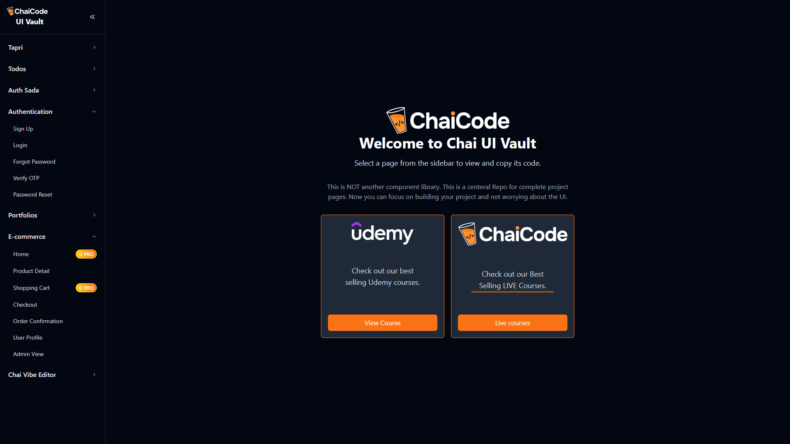

# 🤖 Browser Automation Agent

## 📁 Project Structure

```
automation-assignment/
├── assignment.js         # Main automation script
├── package.json         # Project metadata and dependencies
├── .env                 # Environment variables (API keys, etc.)
├── .gitignore           # Git ignore rules
├── public/              # Reference screenshots for documentation
│   ├── screenshot_001.png
│   ├── screenshot_002.png
│   └── screenshot_003.png
├── screenshots/         # Screenshots captured during automation runs
│   ├── screenshot_001.png
│   ├── screenshot_002.png
│   ├── screenshot_003.png
│   ├── screenshot...
└── readme.md            # Project documentation
```

This project is an experimental **browser automation agent** built using  
[Playwright](https://playwright.dev/) + [OpenAI Agents](https://www.npmjs.com/package/@openai/agents).  
The goal is to automate navigation, interaction, and form submission on websites  
while documenting each step with **screenshots** and a **video walkthrough**.

---

## 🚀 Features
- 🌐 Automated navigation with Playwright (Chromium / Chrome)
- 🖱️ Tools for clicking, typing, scrolling, and form handling
- 📸 Automatic **screenshots saved locally** for each major step
- 📝 Debug tools to dump iframe HTML for troubleshooting
- 🤝 Agent-driven workflow using `@openai/agents`

---

## 📂 Screenshots

Screenshots are saved automatically inside the `screenshots/` folder and are available in `/public` for reference:

| Step | Screenshot |
|------|------------|
| Initial page load |  |
| After navigating to [ChaiCode UI](https://ui.chaicode.com) |  |
| Attempted sign-up page |  |

---

## 🎥 Demo Video
👉 [Watch the YouTube walkthrough here](https://youtu.be/pB5QqEMNmNM)

---

## ⚙️ How It Works
1. **Launch Browser** → Opens Chrome with Playwright  
2. **Navigate** → Goes to `https://ui.chaicode.com`  
3. **Interact** → Locates the *Sign Up* flow and attempts to fill in form fields  
4. **Document** → Captures screenshots at each step + debug HTML dumps if selectors fail  

---

## 📦 Setup & Run

### 1. Install Dependencies
```bash
npm install
